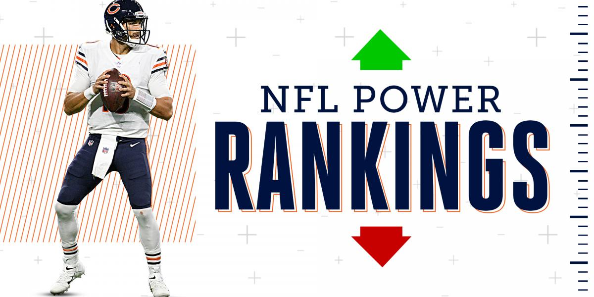
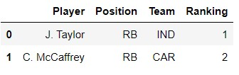
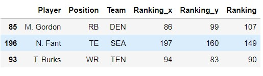
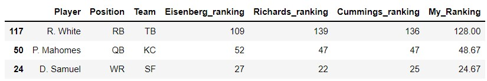
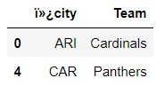
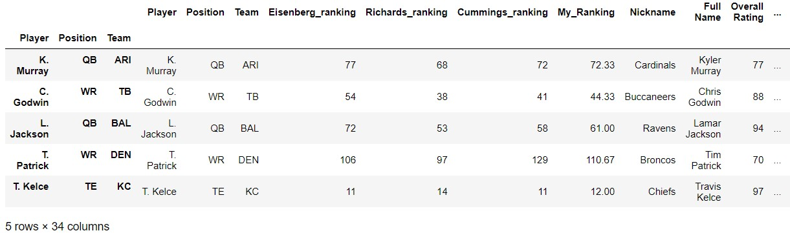
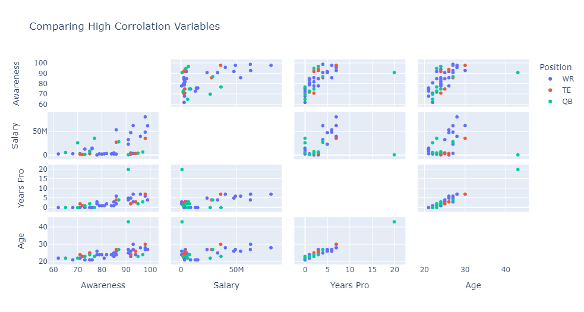
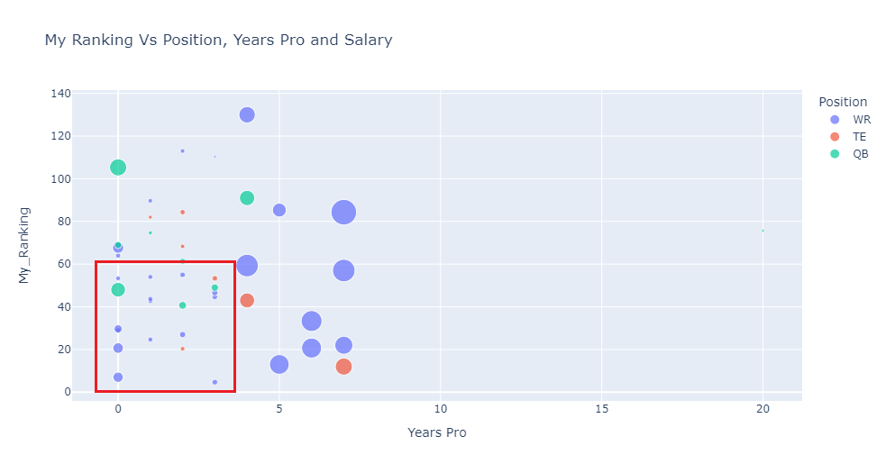
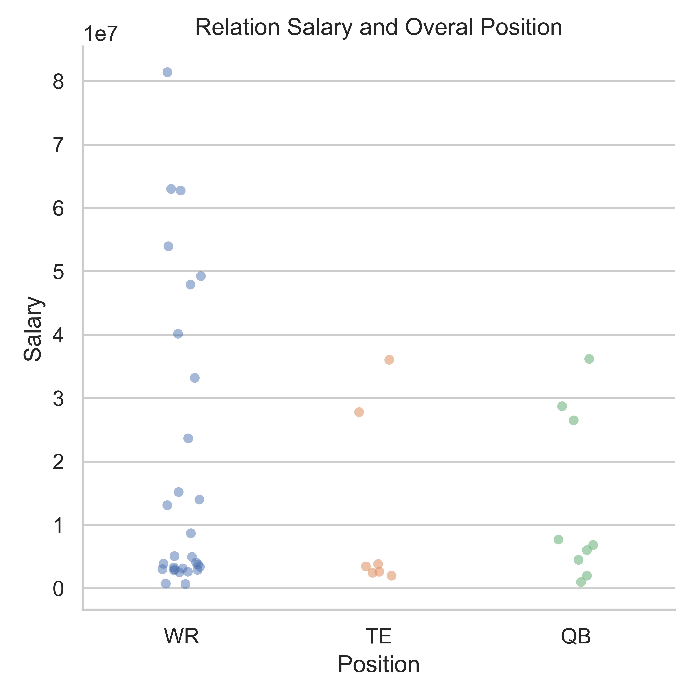

#

# Project II Pipeline
## Web Scrapping for NFL players rankings
### By: Edgard Cuadra
### Date: July 25th 2022

#

#
## Hypothesis:
#

Use the 3 diferent experts ratings for top ranked players and add their overall rating stats to select the best player to draft within a budget cap. can we select the best posible draft out of this corrolation, and if there are any indication of which characteristics of the players i should prioritize when drafting to have the best posible outcome?
#

### Lets try and avoid dropping the ball!
 

  
 

#
## Data Cleaning:
#
First we find the webpage we want to get the information from so that we can scrape the data out of it. to make it legible we transform in into html format by using beutifulsoup.
 

"https://www.cbssports.com/fantasy/football/rankings/"
 

  
 

once we get the content in a format we can use we can proceed to extract the information wanted, in this cases we need player name, team, position and ranking. Now that we have extracted the information into separate lists we need to converge them into a dictionary in order for us to be able to turn it into a dataframe.
 
Getting as a result:

The web page pulled all the rankings into one dataframe, we need proceed to great 3 dataframes with the rankings. using iloc we are going to cut the dataframe into 3 tables and after merge them with the name index. we did this by using the next code:

    eisenbergranking = allrankings.iloc[0:200,:].reset_index(drop=True)
    richardranking = allrankings.iloc[200:400,:].reset_index(drop=True)
    cummingsranking = allrankings.iloc[400:600,:].reset_index(drop=True)

    x = [eisenbergranking, richardranking, cummingsranking]

    test = reduce(lambda left,right: pd.merge(left,
    right,on=['Player',"Position","Team"],how='outer'), x)

This gave us a table more sutable for our use:

From here on we did some minor ajustments and proceeded to make a calculated column with the average ranking and also renamed our columns to make it more readable.

Now that we have a usable table lets import the table wit the players stats that will help us determine the abilities every player excels with. this data base is being imported from kaggle and contains usefull information for all the players including salary.
 

The table we imported has too much information that we dont need so we will drop the columns that are of no use to us, we can use the following code to eliminate by column position and make it easier and faster for us to drop the columns.
  

Used the following code to drop specific columns:

    nfl_stat2 = nfl_stat.drop(nfl_stat.columns[[11,12,13,14,15,16,17,20,21,22,23,24,25,26,28,29,30,33,34,35,36,37,38,39,40,41,42,43,44,45,46,47,48,49,50,51,52,53,54,55,56,58,62,63]], axis=1) 
  
In order to merge the two tables by thei identifying names we will have to use the same nomenclatures, thus the best approach would be to break into two columns and rearrange to get the desired initial and last name format.
  

Used the following code to get the correct format to merge both tables:

    nfl_stat2['lastname'] = nfl_stat2['Full Name'].str.split(' ', expand=True)[1]
    nfl_stat2['initials_'] =nfl_stat2['Full Name'].str.split('', expand=True)[1]
    nfl_stat2['short_name'] =  nfl_stat2['initials_']+ '. ' + nfl_stat2['lastname']

In order to merge both tables we need a bridge to tie the name with the nick name of the team, so we proceed to import another table that will help us get the missing piece of the puzzel and complete the tables before me merge them.
  

Now that we are certain that theres a match between this column its time to concatinate the tables, we want a inner cause we want to bring only the informarion of the top players and not all the 2500 players in the NFL league

We used the following code to make concat with a inner join, making it so that we keep only the information that there is a match where our top rank players receive the columns with all the stats of the ratings table

    toprank_stats = pd.concat([topranked2, final3], axis=1, join='inner')

Our final product is a table with all the information together and ready for visualization. 

Sample of the table:

#

Lets Get Started with the Visuals!

  

#
## Visualization and Storytelling:
#

Having the Data base ready for analysis we can proceed to check the numerical variables and see if there is any corrolation between them to enfasize our analisis on thos variables that have some kind of relationship. it is important to understand that the corrolation does not mean causality. 

As seen in the graph bellow there strong corrolation of age and some key perfomance statistics.

Lets check how age, years players, salary and awareness take a play into havin better selection of players. it apears that there is an increase of awarenes with age and that higher awareness gives can result in a higher salary for the player which can affect the teams salary cap. so we are looking for a player that doesnt have many years pro but a relatively good awareness so that it wont take a hit on the teams salary cap. 

Lets check a bar plot with the dispesion of salary and overall stats rating. this shows that the better the overall stats the more likely a player will have a greater salary, for a cost concious team it wouldnt be recomended to draft the best overall player because it can impact directly into the teams cap and limit a good overall player that can contribute to the teams consistency output. 

When looking to a dispersion of the ranking i made and the years a player has in the league linked to the position played and the salary receive. we can observe that there are some highly ranked players that are not expensive and can probably perform in a cost consious team. so we are looking for players in the red square displayed in the following image. 

Also taking into account that WR position seems to be the most expensive position to aquire the low cost players will fly off the board faster thus it would be recomended for the priority while drafting be the WR players that are most cost effective. 

Also, the main variables of the players attributes seem to be the highest at the position WR. 

We would want to draft playesr whose performance is withing a range of 80 to 90 points out of the 100. this to make sure that our player isnt the best but has the ability to develo if he is young.

#
## Conclusion and Recomendations:
#

For the Draft out of the top 50 players available given the ratings of experts and the rating of abilities of players we can conclude that:

the priority of the drat should be WR that are young and within 5 years in the league with attributes in the ranges of 80 and 90 that most likely will have salaries that are in range of a salary cap concious team.

LET'S DRAFT BABY!

  

